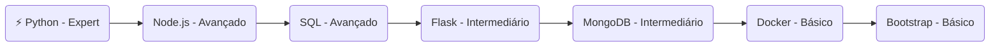

```md
<h1 align="center">Cleiton Carvalho 🚀</h1>

<p align="center">
  <b>Engenheiro de Software | Automação | Machine Learning</b>
</p>

---

## 📌 Sobre mim

Com mais de **11 anos de experiência** em TI, iniciei minha carreira no suporte técnico e desenvolvi forte habilidade em **algoritmos e lógica de programação**. Após uma passagem pelo varejo, percebi a importância da **automação de processos** e retomei minha jornada na programação, focando em **Python, SQL e desenvolvimento de APIs**.

Atualmente, atuo como freelancer em **99Freelas, Workana e UpWork**, desenvolvendo soluções em **Flask, Node.js e Machine Learning** para otimizar processos e agregar valor aos negócios.

---

## 🛠️ Tecnologias

<div align="center">
  
</div>

### 🔥 Expertise em Tecnologias



---

## 🚀 Projetos

🔹 [Automação com Python](https://github.com/cleitoncarvalho/projeto-automacao)
🔹 [API com Flask e SQL](https://github.com/cleitoncarvalho/api-flask-sql)
🔹 [Machine Learning](https://github.com/cleitoncarvalho/ml-previsoes)

---

## 📩 Contato

📞 [WhatsApp](https://wa.me/5598991787180)  |  📧 [Email](mailto:cleiton.engsoft@gmail.com)
```
